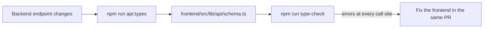

# API contract

The backend's OpenAPI schema is the single contract between the apps. FastAPI generates it; the frontend generates its types from it. How requests travel is in [[architecture/frontend]].

## Endpoints (as of 2026-09)

### `POST /predict`

Takes one page image as the multipart field `image`. The model behind it is a mock for now.

| Status | Body                                        | When                                             |
| ------ | ------------------------------------------- | ------------------------------------------------ |
| 200    | `{ "prediction": number, "model_version": string }` | The image was accepted.                  |
| 400    | `{ "detail": "Empty file" }`                | The file has no bytes.                           |
| 415    | `{ "detail": "File must be an image" }`     | The content type isn't `image/*`.                |
| 422    | `{ "detail": [{ "msg": ..., "loc": ... }] }` | FastAPI validation, e.g. the field is missing.  |
| 502    | `{ "detail": "..." }`                       | Sent by the frontend proxy when the backend is down. |

The 400 and 415 responses aren't in the OpenAPI schema, so `errorMessageFromBody` in `frontend/src/lib/api/client.ts` reads `detail` for every error shape.

## Keeping the frontend in sync

- `frontend/src/lib/api/schema.ts` is generated and committed. Never edit it by hand.
- Endpoint modules derive their types from `paths[...]` (see `predict.ts`), so renaming a route, a form field or a response key fails the type check instead of failing at runtime.
- `npm run api:check` fails when the committed types no longer match a running backend. It isn't in `check.sh` because it needs the backend up; CI can run it once both apps are on `main`.
- Frontend code must never retype a response by hand ([[workflow/definition-of-done]]).
