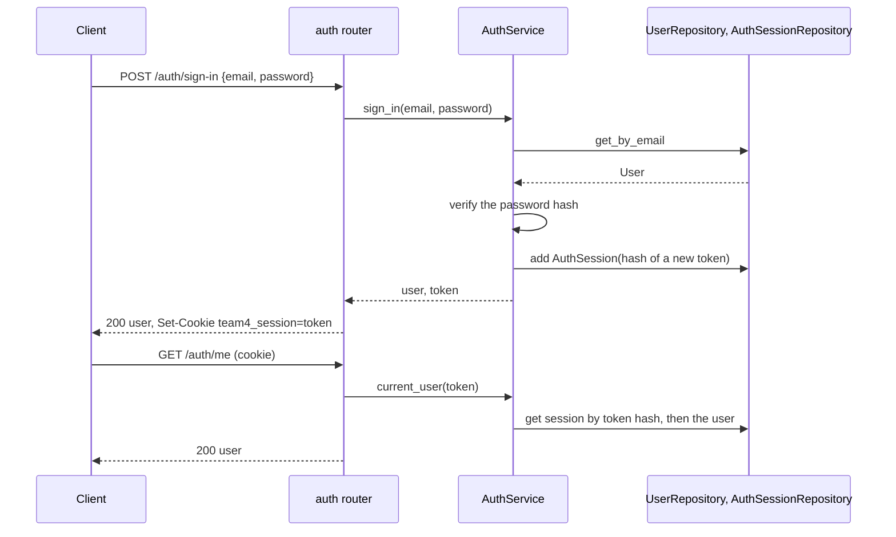

# Authentication

People sign up with an email, a password and, if they like, their first and last name, then sign in with the email and password (#31). The backend keeps the session in the database and hands the browser a cookie.

## Endpoints

| Endpoint              | Does                                                                   | Errors                                          |
| --------------------- | ---------------------------------------------------------------------- | ----------------------------------------------- |
| `POST /auth/sign-up`  | Creates the account and signs it in. First and last name are optional. | 400 bad email or short password, 409 email used |
| `POST /auth/sign-in`  | Starts a new session. Returns the user.                                | 401 wrong email or password                     |
| `POST /auth/sign-out` | Ends the session and clears the cookie.                                | none                                            |
| `GET /auth/me`        | Returns the signed-in user.                                            | 401, and clears a stale cookie                  |

## Rules

- Emails are trimmed and lowercased, so `Ada@Example.com` and `ada@example.com` are one account.
- Names are trimmed; a blank name is stored as no name.
- Passwords need at least 8 characters. They're stored as Argon2 hashes (`pwdlib`), never as text.
- A wrong password and an unknown email get the same answer in about the same time, so sign-in doesn't reveal who has an account.
- A session lasts 7 days. Signing out ends it right away.
- The cookie `team4_session` is `HttpOnly` and `SameSite=Lax`, so page scripts can't read it and other sites can't send it. It isn't `Secure`, because the app runs over plain http on a laptop.
- `/predict` and `/capture-sessions` don't need a session: the mobile app and the phone in the QR flow don't sign in.

The rules live in `AuthService` in `backend/src/app/auth/service.py`; the routes in `backend/src/app/auth/router.py` only translate errors to status codes. A route that needs a signed-in user takes `CurrentUser` from the router module.

## Sign in

The tables are in [[architecture/database]]. How the web app signs in and guards its pages is in [[architecture/frontend]].
