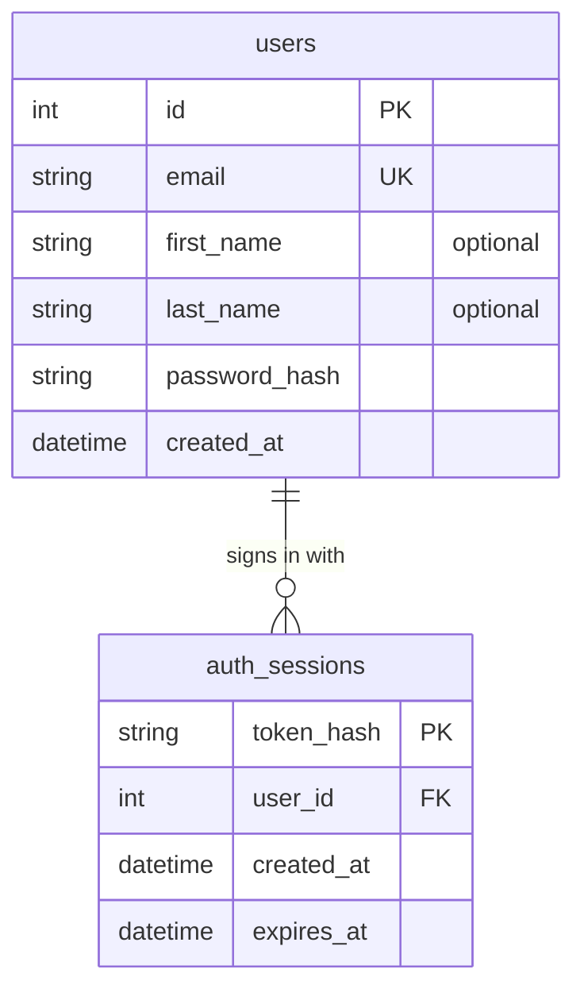

# Database

The backend keeps its data in SQLite, in `backend/data/team4.db` (not committed). Why SQLite: [[adr/0003-sqlite-database]].

## Tables

The tables hold accounts for sign-in (#31).



- `auth_sessions` stores a hash of each session token, never the token itself, so a copy of the database can't be used to sign in.
- Deleting a user deletes their sessions (`ON DELETE CASCADE`).
- Times are stored in UTC.

## Code

| What                    | Where                                                                             |
| ----------------------- | --------------------------------------------------------------------------------- |
| Engine and migrate step | `create_db_engine`, `migrate` in `backend/src/app/db.py`                          |
| Models                  | `User`, `AuthSession` in `backend/src/app/auth/models.py`                         |
| Database access         | `UserRepository`, `AuthSessionRepository` in `backend/src/app/auth/repository.py` |
| Migrations              | `backend/src/app/migrations/versions/`                                            |

Only repositories run queries. Services and routes get data through them.

## Migrations

The backend runs every pending migration when it starts. To change the schema, start the backend once so your local database is current, edit the models, then in `backend/`:

```bash
uv run alembic revision --autogenerate -m "add pages table"
```

Read the generated file before committing it. `test_migrations_match_the_models` in `backend/src/app/tests/test_db.py` fails when the models and migrations disagree.

Set `DATABASE_URL` to use another file, for example `DATABASE_URL=sqlite:////tmp/scratch.db`. To start over locally, stop the backend and delete `backend/data/`.
