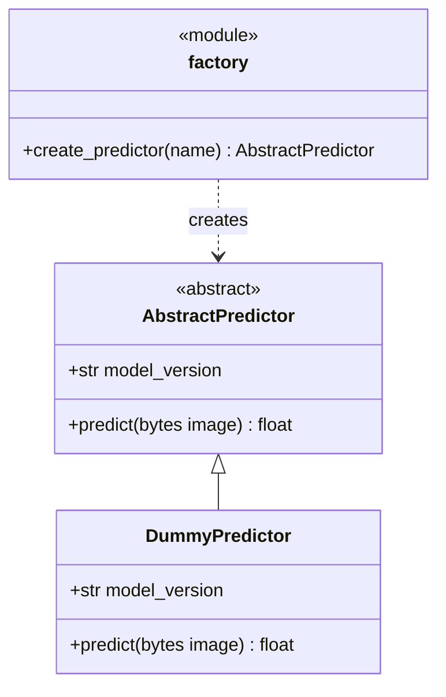

# Design patterns

Patterns that are in the code today. When a new one lands, add a row with the file and the symbol.

| Pattern              | Where                                                            | Why                                                                                                                              |
| -------------------- | ---------------------------------------------------------------- | -------------------------------------------------------------------------------------------------------------------------------- |
| Factory              | `create_predictor` in `backend/src/ml/factory.py`                | Builds the predictor named by its argument or by the `ML_PREDICTOR` environment variable, so switching models doesn't touch the route. |
| Strategy             | `AbstractPredictor` in `backend/src/ml/predictor.py`             | Every model has the same `predict` and `model_version`, so `/predict` works with any of them. `DummyPredictor` is the only one today. |
| Dependency injection | `get_predictor` and `capped_image` in `backend/src/app/main.py`  | FastAPI `Depends` hands the route its predictor and the checked image bytes, so the route doesn't build them itself.             |
| Adapter              | `LoadingOrb` in `frontend/src/components/ui/loading-orb.tsx`     | The only import of `thinking-orbs`, so the animation library can be swapped in one place.                                        |

## Predictor classes

