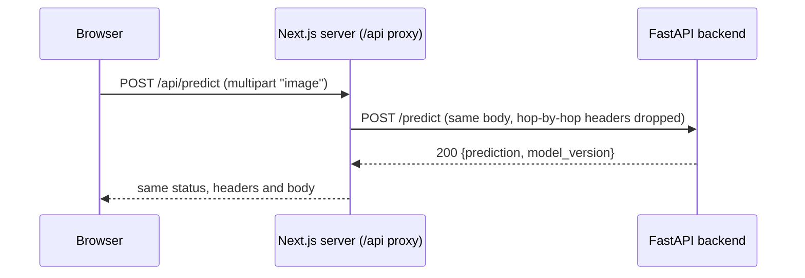

# Frontend

The web app in `frontend/`. Setup and scripts are in `frontend/README.md`; the stack choice is [[adr/0001-web-frontend-stack]].

## Request path

- The browser only ever calls `/api/*`. The proxy (`frontend/src/app/api/[...path]/route.ts`) forwards to `API_INTERNAL_URL`, read at runtime, so one Docker image works against any backend and the backend needs no CORS.
- It's a Route Handler, not a rewrite, because it follows FastAPI's redirects on the server. A rewrite would hand them to the browser, which would then call the backend directly.
- It carries no business logic. If the backend is down it answers 502 with a FastAPI-style `detail`, so the UI shows one kind of error either way.
- It drops the `Expect: 100-continue` header: curl sends it for uploads over 1 MB, and Node's fetch refuses to forward it.
- Bodies are buffered, not streamed, so a redirect can resend them. That's fine up to the 50 MB page limit.

## Code layout

| Where                                   | What                                                                  |
| --------------------------------------- | --------------------------------------------------------------------- |
| `frontend/src/lib/api/client.ts`        | `apiRequest` and `ApiError`: the only way to call the backend.        |
| `frontend/src/lib/api/predict.ts`       | One module per endpoint group, typed from the generated schema.       |
| `frontend/src/hooks/use-predict.ts`     | TanStack Query mutation; all server state goes through hooks.         |
| `frontend/src/components/recognition/`  | The upload and recognition flow.                                      |
| `frontend/src/components/ui/`           | shadcn primitives plus `LoadingOrb` and `Skeleton`.                   |

How the types stay in sync with the backend: [[architecture/api-contract]].

## Loaders

Taken from servicehub, the team's reference project:

- `LoadingOrb` wraps `thinking-orbs` and is its only import, so the library can be swapped in one place. On the recognition card it sits paused while idle and animates while the model reads the page.
- `Skeleton` uses a sweeping sheen, not a pulse (a pulse reads as disabled), and each skeleton mirrors the layout it stands in for so nothing shifts when data arrives.
- A route's `loading.tsx` mirrors that page's first paint.

## Theming

Tokens live in `frontend/src/app/globals.css`: lapis ultramarine for actions, rubric red as the one accent, cool neutrals so page scans stay the warmest thing on screen. Every text pair meets WCAG AA in light and dark mode. Components use tokens only, never raw colours.

## Gotchas

- The root `.gitignore` is the Python template and ignores every `lib/` folder. `frontend/.gitignore` re-includes `src/lib`; without that line the API client silently never reaches git.
- `next dev` writes `AGENTS.md` and `CLAUDE.md` into `frontend/`. Both are gitignored.
- The React Compiler is on; the react-hooks lint rules enforce what it needs.
