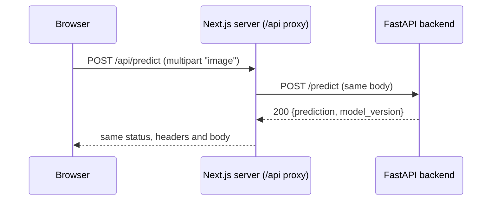

# Frontend

The web app in `frontend/`. Setup and scripts are in `frontend/README.md`; why this stack is in [[adr/0001-web-frontend-stack]].

## Request path

```mermaid
sequenceDiagram
    participant B as Browser
    participant N as Next.js server (/api proxy)
    participant F as FastAPI backend
    B->>N: POST /api/predict (multipart "image")
    N->>F: POST /predict (same body)
    F-->>N: 200 {prediction, model_version}
    N-->>B: same status, headers and body
```

- The browser only calls `/api/*`. The proxy (`frontend/src/app/api/[...path]/route.ts`) forwards to the backend URL in `API_INTERNAL_URL`, read at runtime, so the backend needs no CORS.
- It's a Route Handler rather than a rewrite, so FastAPI's redirects are followed on the server instead of sending the browser to the backend.
- It holds no logic. If the backend is down it answers 502 with a FastAPI-style `detail`, so the UI handles one error shape.

## Code layout

| Where                                  | What                                                           |
| -------------------------------------- | -------------------------------------------------------------- |
| `frontend/src/lib/api/client.ts`       | `apiRequest` and `ApiError`, the only way to call the backend. |
| `frontend/src/lib/api/predict.ts`      | One module per endpoint group, typed from the generated schema. |
| `frontend/src/hooks/use-predict.ts`    | TanStack Query mutation. All server state goes through hooks.  |
| `frontend/src/components/recognition/` | The upload and recognition flow.                               |
| `frontend/src/components/ui/`          | shadcn primitives plus `LoadingOrb` and `Skeleton`.            |

## Loaders

- `LoadingOrb` is for waits the user watches, like the model reading a page.
- `Skeleton` stands in for content that is loading. It has the same shape as that content, so nothing jumps when the data arrives.

## Styling

Tokens live in `frontend/src/app/globals.css`, and components use tokens, never raw colours. The rules are in [[architecture/design-system]].

## Gotcha

The root `.gitignore` ignores every `lib/` folder. `frontend/.gitignore` re-includes `src/lib`; without that line the API client never reaches git.
