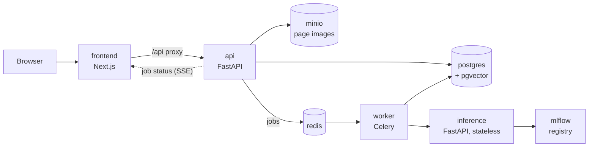

# System overview

A one-page map of Codex Lens. The target architecture comes from [[requirements]] (section 6); this note also says what exists today.

## Services

| Service   | Owns                                                        | Notes                                      |
| --------- | ----------------------------------------------------------- | ------------------------------------------ |
| frontend  | UI only; talks to `api` through its proxy                   | [[architecture/frontend]]                  |
| api       | Business logic, auth, CRUD                                  | [[architecture/api-contract]]              |
| inference | Serving models loaded from the MLflow registry              | [[ml/README]]                              |
| worker    | Pipeline jobs and retraining                                | [[architecture/design-patterns]]           |

## What exists today (as of 2026-09)

- `frontend/`: the upload and recognition flow of issue #7.
- `backend/` on branch `Backend-initialisation`: FastAPI with a mocked `POST /predict`.
- Everything else in the diagram is still to build, in the order of the milestones in [[requirements]].

## Recognition pipeline

Each step is its own `PipelineStep`, testable alone and chained by the worker ([[architecture/design-patterns]]).

Processing is always asynchronous: a request creates a `Job` and returns at once, and the frontend follows the job's status. Target: one page in under 60 s on a GPU, under 5 min on a CPU.

## Data model

`User`, `Manuscript`, `Page`, `Line`, `Transcription`, `WordRegion`, `Job` and `ModelVersion`, with their fields listed in [[requirements]] (section 6.4). Every read and write goes through a repository class; routes never touch the ORM.
