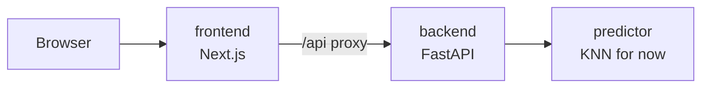

# System overview

What exists today (as of 2026-09): a web app and a backend with one endpoint. The backend runs a mock model, so the whole path works before a real model is in.

```mermaid
flowchart LR
    Browser --> Frontend["frontend<br/>Next.js"]
    Frontend -->|"/api proxy"| Backend["backend<br/>FastAPI"]
    Backend --> Predictor["predictor<br/>KNN for now"]
```

## Stack

| Part    | Stack                                                                       | More                                                       |
| ------- | --------------------------------------------------------------------------- | ---------------------------------------------------------- |
| Web app | Next.js 16, React 19, TypeScript, TanStack Query, Tailwind CSS 4, shadcn/ui | [[architecture/frontend]], [[adr/0001-web-frontend-stack]] |
| Backend | Python 3.13, FastAPI, uv                                                    | `backend/README.md`, [[architecture/api-contract]]         |
| Tests   | Vitest, Playwright, pytest, Bruno                                           | [[architecture/testing]]                                   |
| CI      | GitHub Actions                                                              | [[workflow/git-workflow]]                                  |

A mobile app is in progress in #13. There's no database, file storage or real model yet; each gets a section here when it lands.
