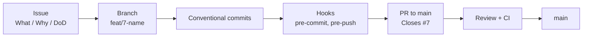

# Workflow

How work moves from an idea to `main`. The spec's rules are in [[requirements]] (section 9.4).

| Note                              | What it covers                                                  |
| --------------------------------- | --------------------------------------------------------------- |
| [[workflow/issues]]               | Writing issues and user stories, milestones.                    |
| [[workflow/git-workflow]]         | Branches, commits, pull requests, git hooks.                    |
| [[workflow/definition-of-done]]   | What "done" means for every story.                              |
