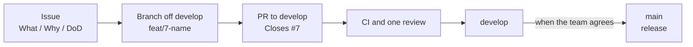

# Workflow

How a change gets from an issue to a release.

```mermaid
flowchart LR
    Issue["Issue<br/>What / Why / DoD"] --> Branch["Branch off develop<br/>feat/7-name"] --> PR["PR to develop<br/>Closes #7"]
    PR --> Review["CI and one review"] --> Develop["develop"] -->|"when the team agrees"| Main["main<br/>release"]
```

| Note                            | What it covers                               |
| ------------------------------- | -------------------------------------------- |
| [[workflow/issues]]             | Writing issues and user stories.             |
| [[workflow/git-workflow]]       | Branches, commits, pull requests, hooks, CI. |
| [[workflow/definition-of-done]] | What done means for every story.             |
