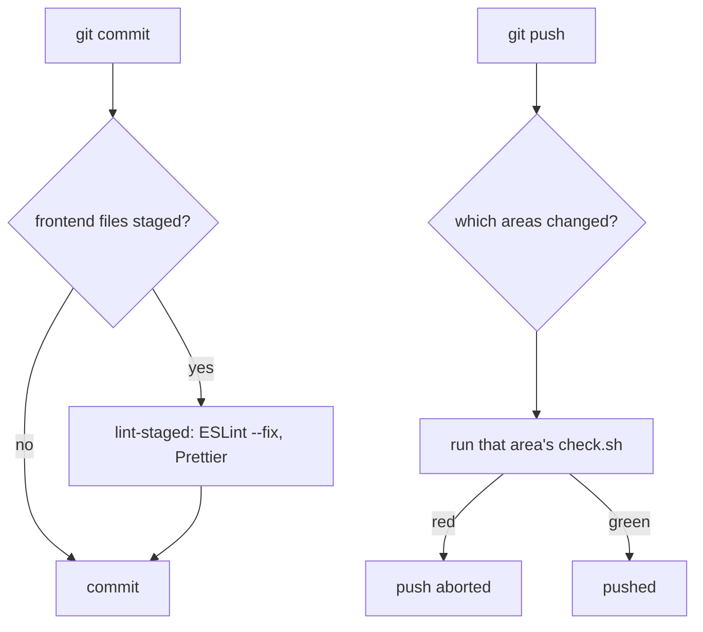

# Git workflow

Trunk-based: short-lived branches off `main`, merged through reviewed PRs. Work starts from an issue ([[workflow/issues]]) and ends at the [[workflow/definition-of-done]].

## Branches and commits

- Branch names: `feat/<issue>-short-name`, or `fix/`, `test/`, `docs/`, `chore/`.
- Commits follow Conventional Commits, one line each: `feat(frontend): ...`, `fix(backend): ...`, `test: ...`, `docs: ...`. The scope is the area: `frontend`, `backend`, `ml`, `docs`, `ci`.

## Pull requests

- The body follows `.github/pull_request_template.md` and starts with `Closes #<issue>`, so merging closes the issue.
- Sections: What, Why, How, Testing, Screenshots (light and dark), Definition of Done. Delete the sections that don't apply.
- Merging needs green checks and one approving review from a teammate.
- Keep PRs small, so every teammate's work stays visible in the history.

## Git hooks

Turn them on once per clone with `bash scripts/install-hooks.sh`. It points `core.hooksPath` at the tracked `.githooks/` folder, so hook changes reach everyone on the next pull.

- **pre-commit** fixes and lints exactly what is staged, and fails on anything it can't fix.
- **pre-push** runs `check.sh` for each area the push touches. Today that's `frontend/check.sh` (lint, format, type check, unit tests) and `docs/check.sh` (the vault lint). An area without a `check.sh` is skipped, so `backend/` and a mobile app join by adding one.
- Bypass once with `--no-verify`, but only on purpose.

The same check scripts are what CI will run (issue #5), so a green push means a green CI.
