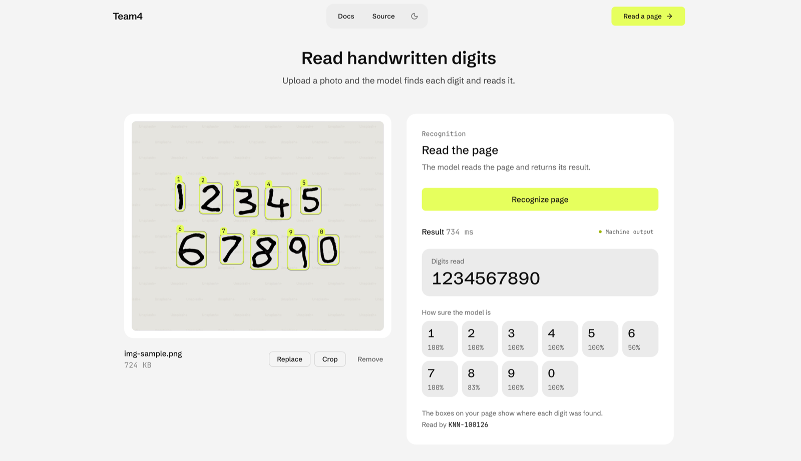
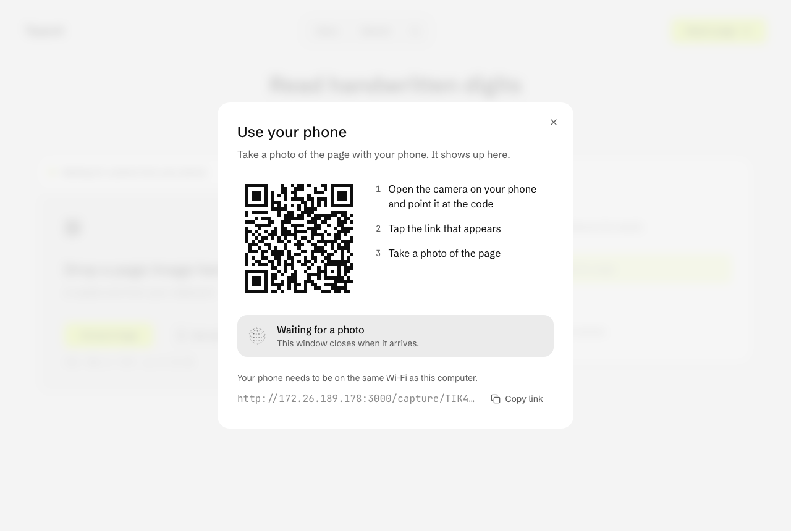

# Team4 frontend

Next.js 16 (App Router) + React 19 + TypeScript + Tailwind CSS 4 + shadcn/ui. Why this stack:
[ADR 0001](../docs/adr/0001-web-frontend-stack.md).

Today it covers: choose, drop or paste a page image, or take one with your phone, send it to the
backend's `POST /predict`, and show the digits the model read, with a box over each one on the page.



## Getting started

Needs Node 24 (`nvm use` reads the repo's `.nvmrc`) and the backend running on
http://localhost:8000 (see `backend/README.md`).

```bash
cd frontend
npm install
cp .env.example .env.local   # optional: only if the backend isn't on localhost:8000
npm run dev
```

Open http://localhost:3000. The browser only talks to `/api/*`; the Next.js server forwards it
to `API_INTERNAL_URL`, so the backend needs no CORS setup.

## Scripts

| Command              | What it does                                                    |
| -------------------- | --------------------------------------------------------------- |
| `npm run dev`        | Dev server with hot reload                                      |
| `npm run build`      | Production build                                                |
| `npm run start`      | Serve the production build                                      |
| `npm run pre-commit` | The full gate (`check.sh`): lint, format, type check, tests     |
| `npm run lint`       | ESLint (warnings fail); `lint:fix` fixes what it can            |
| `npm run format`     | Prettier write; `format:check` only checks                      |
| `npm run type-check` | Route type generation + `tsc --noEmit`                          |
| `npm test`           | Vitest unit and component tests (`test:watch`, `test:coverage`) |
| `npm run e2e`        | Playwright end-to-end tests (backend must be running)           |
| `npm run api:types`  | Regenerate `src/lib/api/schema.ts` from the backend OpenAPI     |
| `npm run api:check`  | Fail if `schema.ts` is out of date with the backend             |

First time running `npm run e2e`: `npx playwright install --only-shell chromium`.

## Keeping in sync with the backend

Request and response types are generated from the backend's OpenAPI schema, never typed by
hand. After a backend change:

```bash
npm run api:types                          # backend running on :8000
npm run api:types -- path/to/openapi.json  # or from a saved schema
npm run type-check                         # shows every place the change breaks
```

## Project structure

```
src/app/                    routes (App Router); api/[...path] is the backend proxy
src/components/recognition/ upload and recognition flow
src/components/phone-capture/ QR code dialog and the phone camera page
src/components/ui/          shadcn primitives, LoadingOrb, Skeleton
src/hooks/                  TanStack Query hooks and small React hooks
src/lib/api/                API client, generated schema, one module per endpoint group
src/lib/                    plain helpers (file checks, formatting)
e2e/                        Playwright specs
```

## Image cropping

The web frontend supports free-form cropping for previewable JPG and PNG images before recognition.

After applying a crop, the cropped image replaces the current preview and is sent through the existing `/predict` flow.

TIFF images can still be submitted for recognition, but browser-side cropping is not supported because most browsers cannot preview TIFF images.

## Use your phone



"Use your phone" shows a QR code. Scanning it opens `/capture/<id>` on the phone, which takes a
photo with the phone camera and sends it to the backend. The page on the computer checks every
1.5 seconds and puts each new photo in place of the current page, until you unlink or the link goes
30 minutes without a photo.

- The phone and the computer need to be on the same Wi-Fi.
- A phone can't open `localhost`, so when the app is open on `localhost` the QR code uses the
  computer's network address instead (`src/lib/lan-address.ts`).
- `next dev` only serves its runtime to localhost, so `next.config.ts` adds the computer's network
  addresses and the private network ranges to `allowedDevOrigins`. Without it the phone page loads
  but never becomes interactive.

## Docker

```bash
docker build -t team4-frontend .
docker run -p 3000:3000 -e API_INTERNAL_URL=http://host.docker.internal:8000 team4-frontend
```

`API_INTERNAL_URL` is read at runtime, so one image works against any backend.
